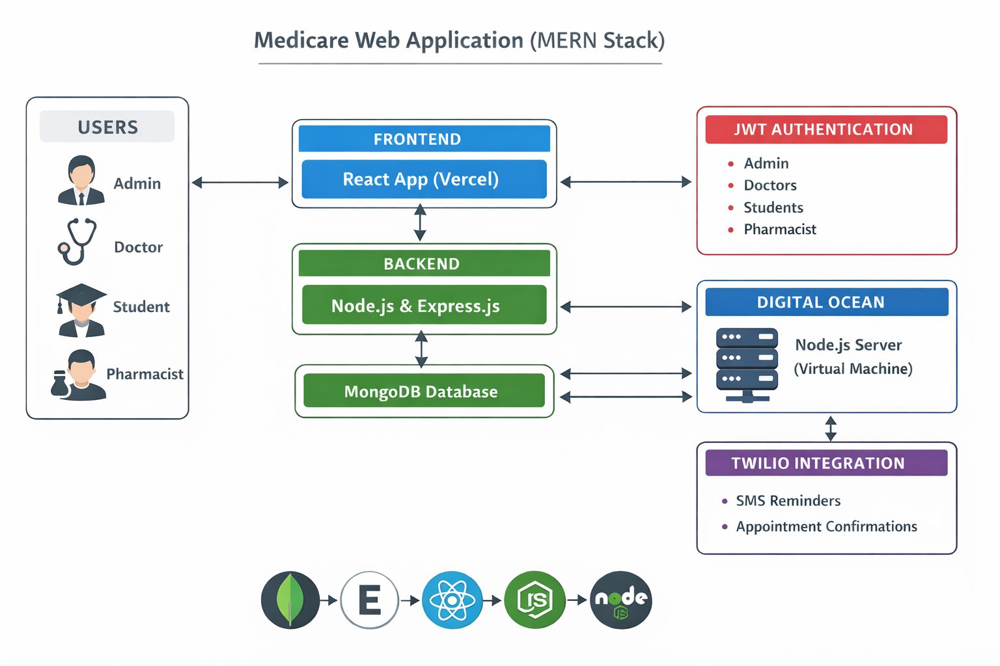
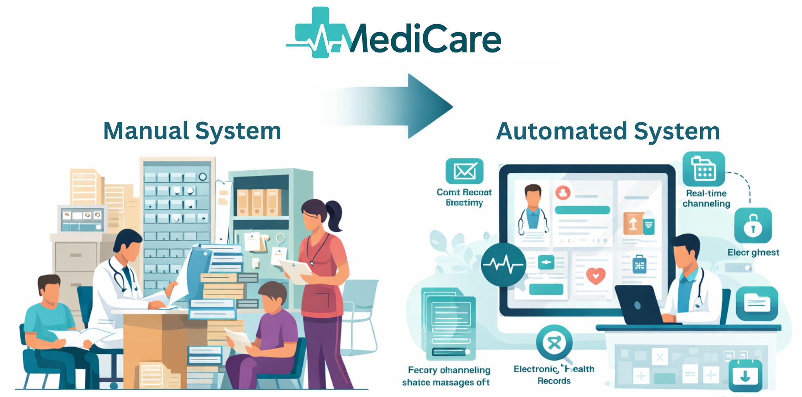
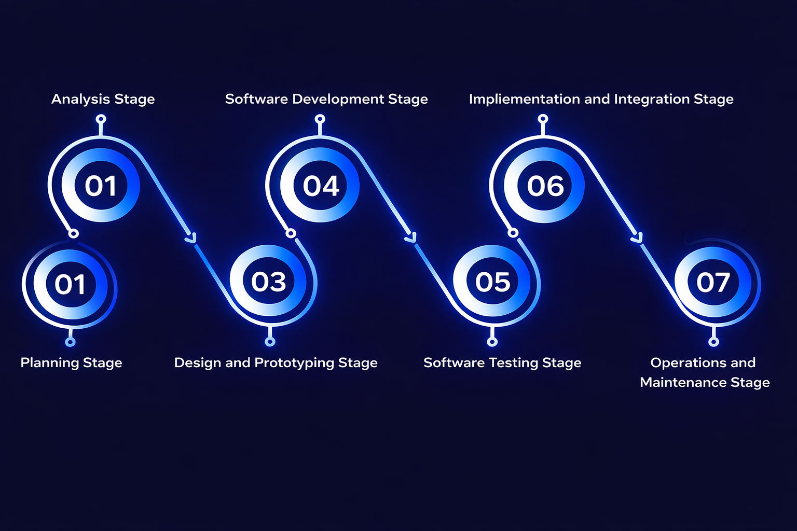

<!-- ===================== -->
<!-- MediCare README START -->
<!-- ===================== -->

<h1>🏥 MediCare – University Medical Center Management System</h1>

<b>A MERN Stack Digital Healthcare Solution for Sabaragamuwa University</b>

<h2>📌 System Overview</h2>

<b>MediCare</b> is a full-stack web application developed to digitalize and modernize
the operations of the <b>Sabaragamuwa University Medical Center</b>.
The system replaces the traditional manual workflow with a secure, efficient,
and centralized digital platform exclusively designed for university students and staff.

  

<h2>📊 Existing Manual System vs MediCare Web Application</h2>

The traditional paper-based system caused delays, data redundancy, and inefficient
appointment handling. MediCare eliminates these limitations by introducing
automation, real-time access, and role-based security.

  

<h2>🚀 Core Features</h2>

<h3>👨‍🎓 Student Module</h3>
<ul>
  <li>Online registration using university email & registration number</li>
  <li>Doctor appointment booking</li>
  <li>Medical request submission</li>
  <li>Electronic medical history access</li>
</ul>

<h3>👨‍⚕️ Doctor Module</h3>
<ul>
  <li>Student medical record management</li>
  <li>Medical request approval system</li>
  <li>Appointment handling</li>
  <li>Treatment history analysis</li>
</ul>

<h3>💊 Pharmacist Module</h3>
<ul>
  <li>Medicine stock control</li>
  <li>Low-stock and expiry alerts</li>
  <li>Real-time inventory updates</li>
</ul>

<h3>🛠️ Admin Module</h3>
<ul>
  <li>User and role management</li>
  <li>System monitoring</li>
  <li>Secure access enforcement</li>
</ul>

<h2>🔐 Security Architecture</h2>

<ul>
  <li>JWT-based authentication</li>
  <li>Role-based authorization (Admin, Doctor, Student, Pharmacist)</li>
  <li>Protected REST APIs</li>
</ul>

<h2>🧰 Technology Stack</h2>

<table border="1" cellpadding="10" cellspacing="0">
  <tr>
    <th>Layer</th>
    <th>Technology</th>
  </tr>
  <tr>
    <td>Frontend</td>
    <td>React.js</td>
  </tr>
  <tr>
    <td>Backend</td>
    <td>Node.js, Express.js</td>
  </tr>
  <tr>
    <td>Database</td>
    <td>MongoDB</td>
  </tr>
  <tr>
    <td>Authentication</td>
    <td>JWT</td>
  </tr>
  <tr>
    <td>Notifications</td>
    <td>Twilio (SMS)</td>
  </tr>
  <tr>
    <td>Deployment</td>
    <td>Vercel & DigitalOcean</td>
  </tr>
</table>

<h2>🔄 Development Methodology</h2>

The MediCare system was developed using the <b>Waterfall Model</b>, ensuring
a structured and disciplined software development lifecycle.

  

<h2>📷 System Snapshots</h2>

  

<h2>📦 Installation & Setup</h2>

<pre>
# Clone repository
git clone https://github.com/your-username/medicare.git

# Backend setup
cd backend
npm install
npm start

# Frontend setup
cd frontend
npm install
npm run dev
</pre>

<h2>🌐 Deployment</h2>

<ul>
  <li><b>Frontend:</b> Vercel</li>
  <li><b>Backend:</b> DigitalOcean Virtual Machine</li>
</ul>

<h2>👨‍💻 Author</h2>

<b>Your Name</b> 
Department of Computing 
Sabaragamuwa University of Sri Lanka

⭐ If you like this project, give it a star!

<!-- =================== -->
<!-- MediCare README END -->
<!-- =================== -->
